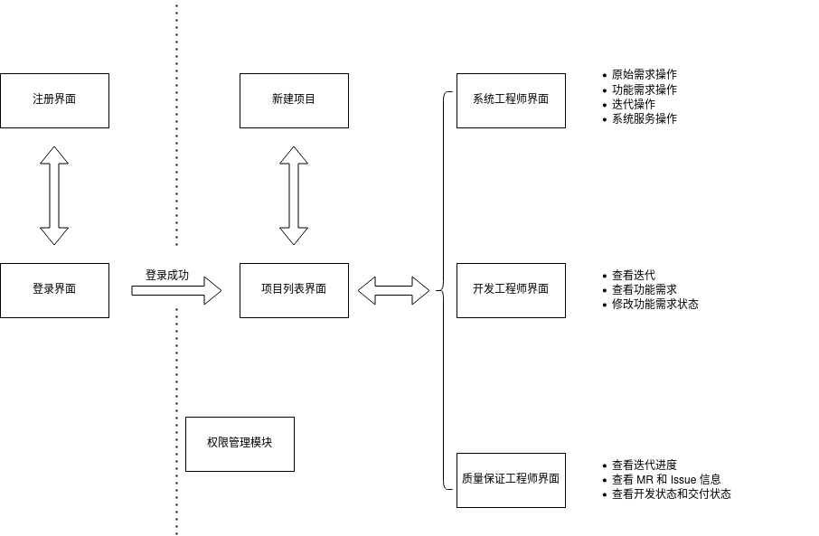
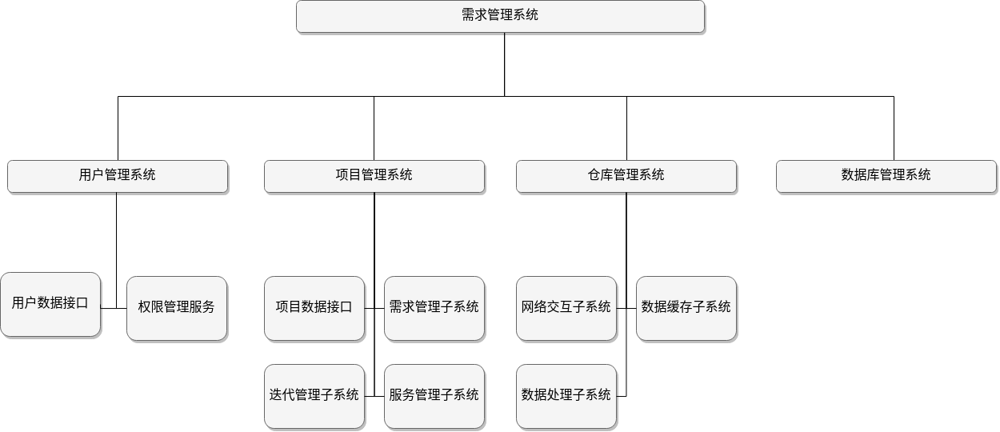
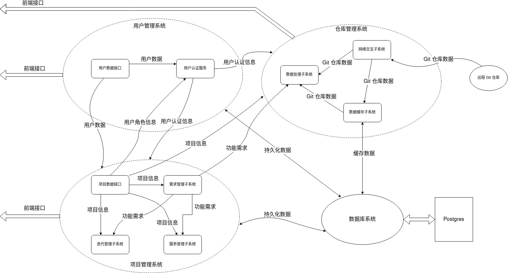
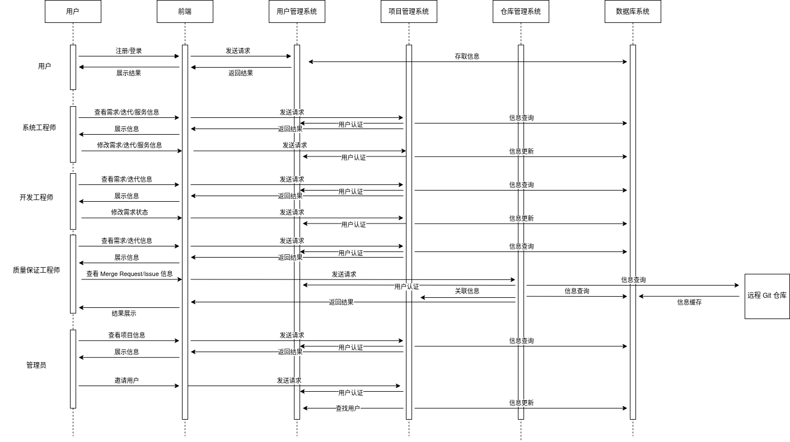

我们的整体架构采用了前后端分离的设计思路，前端主要负责数据的获取和展示，而后端主要负责数据的收集、整合和计算。

## 前端

前端的主要功能是为不同角色的用户提供对应的用户界面和相应的服务，并与后端的相应接口对接，完成用户的各项任务。同时，需要尽可能提升用户的体验，完善人机交互。

根据这一原则，前端被分为了以下几个功能模块。

### 用户登录注册模块

在这一模块中，用户可以完成登录、注册等基本功能，同时，作为系统的入口，需要引导用户进入主系统中。

### 用户权限管理模块

这一模块作为辅助模块，并不实现具体的功能逻辑，而是与后端交互，判断当前用户是否有权限访问当前页面，并在权限不足时提供警告和返回的界面。

### 项目管理模块

这一模块是用户进入主系统后首先看到的模块。这一模块展示了用户所参与的项目以及相应的角色，同时提供了创建项目的用户界面。

### 系统工程师模块

这一模块为系统工程师服务，为系统工程师提供了管理原始需求、功能需求、迭代、系统服务的相关功能界面，实现了原始需求、功能需求、迭代、系统服务的增、删、改、查，并可以实现功能需求与系统服务、迭代之间的绑定。

### 开发工程师模块

这一模块为开发工程师服务，为开发工程师提供了查看迭代和功能需求完成情况、以及修改功能需求开发状态的功能。

### 质量保证工程师模块

这一模块为质量保证工程师服务，为质量保证工程师提供了查看迭代和功能需求完成情况，查看关联 Git 仓库中 Merge Request 和 Issue 的相关状态，以及它们与功能需求的关联情况。同时提供指标用于检测开发工程师的开发状态和交付质量。

---

这些功能模块的相互关系可以通过下图展现。

为了实现这些要求，前端采用了 [React](https://reactjs.org/) 框架，并搭配了 [MUI](https://mui.com/) UI 库，以期达到较为理想的用户体验。同时，通过 [react-router](https://www.npmjs.com/package/react-router)，我们完成了各个界面间的路由。

## 后端

后端的主要工作是保存并处理前端提供的数据，并向前端返回其所需要的数据。在这一过程中，需要保证数据的正确性、完整性、一致性，同时确保后端整体流程的安全性。在此基础上，后端还应具有一定的运行效率以应对较大的吞吐容量。

在模块设计上，后端主要分为了以下几个模块：

### 用户管理系统

这一个系统提供了用户的注册、登录、修改密码等操作接口，同时向其它模块提供了用户认证服务，以确保未授权用户不能够随意访问相应的接口。

### 项目管理系统

这个系统是后端数据处理的核心系统，实现了项目的创建、修改等操作接口，实现了角色分配和权限管理，同时还需要整合处理项目中的各种数据。为了更好的处理项目信息，该系统还包含以下几个子系统：

#### 需求管理子系统

该子系统主要处理原始需求和功能需求的增、删、查、改功能，并提供相关的接口。

#### 迭代管理子系统

该子系统主要处理迭代的增、删、查、改功能，以及其与功能需求的关联绑定。

#### 服务管理子系统

该子系统主要处理系统服务的增、删、查、改功能，以及其与功能需求的关联绑定。

### 仓库管理系统

该系统提供了与 git 仓库（Gitlab）交互的相关系统逻辑，同时与项目管理系统交互，实现上游 git 仓库信息和项目信息的关联和绑定，同时向用户提供了数据查看和修改的接口。该系统分为以下几个子系统：

#### 网络交互子系统

该子系统封装了 Gitlab 提供的相关 API 调用接口，实现了数据的远端拉取和返回。

#### 数据缓存子系统

该子系统用于 Gitlab 数据的缓存和读取，以提升加载速度，同时防止网络波动带来的请求失败。该系统实现了较为完善的缓存逻辑，确保了即使在上游网络不稳定的情况下，用户也能够随时获取数据。

#### 数据处理子系统

该子系统主要与需求管理子系统配合，完成 Merge Request 和 Issue 与项目功能需求的关联、绑定和查询。同时，该系统还能够进行简单的数据处理，将相关的统计数据返回前端，用于开发状态和交付质量的评估。

### 数据库系统

该系统主要负责数据库的连接以及数据模型的管理。

---

后端系统的结构图如下所示：

数据流向如图所示：

在技术选型上，后端采用了 [Node.js](https://nodejs.org/) + [typescript](https://www.typescriptlang.org/) 的基础架构，使用了 [Nest](https://nestjs.com/) + [Express](http://expressjs.com/) 的服务器架构。数据库采用了 Postgres，并使用 [TypeOrm](https://typeorm.io) 进行模型管理。

## 前后端交互

前后端交互时的业务流程图如图所示：

