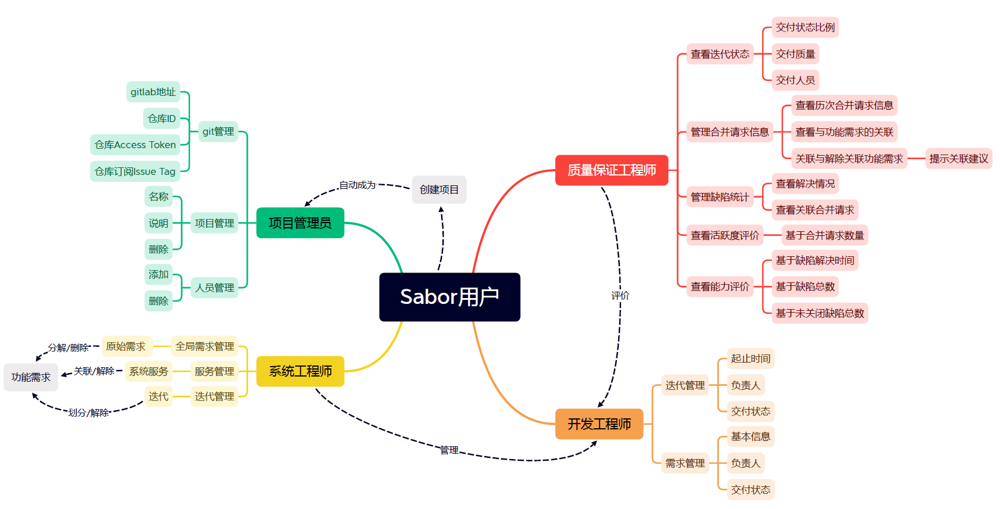
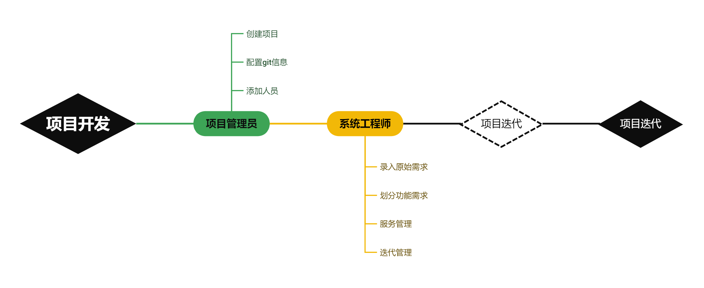
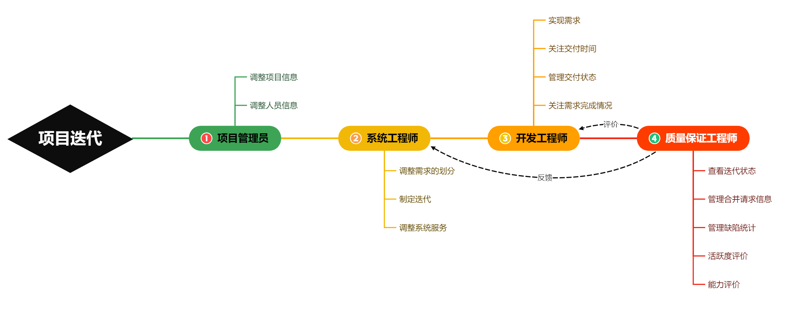

# 需求分析

### 功能需求

#### 项目管理员

  - 项目管理

	查看项目序号、查看或修改项目名称和项目描述，或删除项目。

  - 人员管理

	按照角色（权限）添加或删除成员。同一人员可担任多种角色，项目管理员也可兼任其他角色。支持添加成员，添加成员时输入其用户名精确匹配。

  - git管理

	填写项目所在的gitlab仓库相关信息后，Sabor中项目相关信息和gitlab绑定，并通过呈现gitlab的信息协助项目管理员管理项目。

#### 系统工程师

系统工程师主要工作是管理开发工程师和管理功能需求（简称SR）。系统工程师可在需求管理、服务管理和迭代管理三个页面上创建功能需求，并指定功能需求对应的原始需求（简称IR）和负责实现这项SR的开发工程师。

  - 需求管理

	系统工程师再页面中录入IR，并为IR分解为SR。IR与SR对应关系为一对多，查看这项IR所对应的SR表。页面支持IR和SR的添加、删除与修改。可录入原始需求，每项原始需求表项可支持原始需求的修改或删除。可查看对应的SR表，类似操作可添加或删除SR。

  - 服务管理

	系统工程师根据项目需求将项目分解为粒度较大的“系统服务”，并为系统服务指定功能需求。操作方式和需求管理类似。

  - 迭代管理

	系统工程师支持管理开发过程中的需求迭代过程，并为每次迭代指定计划的功能需求。操作方式和需求管理类似。

#### 开发工程师

开发工程师与代码打交道，负责需求的完成并进行软件迭代。与其他权限不同，开发工程师聚焦于自己负责的部分迭代和功能需求。

  - 迭代状态

	迭代状态页面呈现了项目的历次迭代情况。图的结点表示一次迭代，结点旁边显示迭代计划的交付情况统计，在下拉栏中可查看本次迭代所有的计划完成的SR和截至该时间点实际完成情况。

  - 需求管理

	需求管理界面呈现功能需求完成情况，可选择是否只显示自己负责的需求。点击修改可进行修改操作，根据实际完成情况修改呈现出的状态。每开始完成一个SR，开发工程师将其状态设置为“开发中”，并在交付后修改为“已交付”。

#### 质量保证工程师

  - 迭代状态

	按照时间从近到远顺序呈现项目每一步迭代的完成情况，呈现了迭代过程中每一步的初始化、开发中、已交付的比例。进入详细信息可查看负责该迭代的开发工程师，并统计迭代中git合并请求的次数和缺陷的次数。

  - 合并请求

	用于查看gitlab仓库中的合并请求（Merge Request，MR）。质量保证工程师点击操作按钮可将MR与SR关联或解除关联，便于项目的管理。与所选MR内容相似的SR会在MR-SR关联窗口中给出提示。点击下拉栏可查阅已经关联的SR

  - 缺陷统计

	用于查看开发过程中的缺陷（Issue），并查看缺陷的解决状态：已关闭 / 开启中。下拉栏中显示缺陷在哪些MR修复。

  - 活跃度评价

	质量保证工程师支持查看基于合并请求数量进行的活跃度评价。

  - 能力评价

	质量保证工程师支持查看基于缺陷解决时间、处理的缺陷总数和还在打开中的缺陷数目进行的开发工程师能力评价。

### 用例分析

#### 游客状态

- 注册
- 登录
- 创建项目
- 修改密码
- 退出登录

#### 项目管理员

- 关联gitlab仓库
- 更改项目名称
- 更改项目描述
- 搜索用户
- 添加用户
- 删除用户

#### 系统工程师

- 将原始需求分解为功能需求
- 原始需求的增删改查
- 功能需求的增删改查
- 进行系统服务与功能需求的关联
- 系统服务的增删改查
- 功能需求与系统服务的关联关系的的增删
- 进行迭代计划划分为功能需求
- 迭代的增删改查
- 功能需求与迭代的划分关系的的增删

#### 开发工程师

- 查看迭代起止时间
- 查看迭代交付状态
- 交付后修改交付状态
- 查看每一项需求的信息
- 查看需求交付状态
- 选择显示自己的任务或所有任务

#### 质量保证工程师

- 获取合并请求与功能需求的关联
- 进行合并请求与功能需求的关联
- 获取推荐进行的合并请求与功能需求关联
- 进行合并请求与功能需求的解除关联
- 获取缺陷在哪些合并请求中得到解决
- 评价开发工程师活跃度
- 评价开发工程师能力

### 用例图

### 开发流程图

#### 项目整体开发流程

项目的开发的开始需要项目管理员将项目初始化，关联gitlab仓库，初步邀请成员。接下来系统工程师按照对项目的理解将原始需求划分为功能需求，罗列系统服务，指定迭代计划，指定功能需求完成计划。随后项目在一次次的迭代中完成功能。

- 虚线框表示反复进行

#### 每次项目迭代流程

在每次迭代中项目管理员可对项目做出调整，系统工程师对需求、服务和迭代做出调整。开发工程师负责完成代码，关注需求和迭代计划。质量保证工程师查看迭代状态，对合并请求和缺陷做出管理，在逻辑上维护需求、合并请求、缺陷的关联，同时对开发工程师有评价机制。质量保证工程师可以依据相关信息对项目管理员和系统工程师做出反馈。

